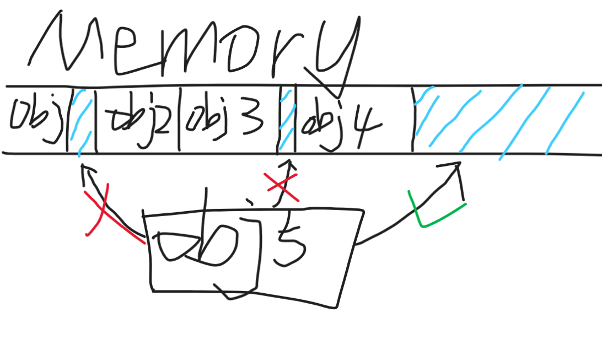

# Unity对象池
## 1、对象池是什么
对象池（Object pool）是一种设计模式。一个对象池包含一组已经初始化过且可以使用的对象，而可以在有需求时创建和销毁对象。

简而言之，你可以将它理解成一个动态数组，在需要的时候启用和关闭数组中的对象。
## 2、为什么要有对象池？
在游戏里，反复被创建和销毁的对象非常普遍，比如子弹、敌人等。

如果我们进行地创建和销毁，机器会承担更大的开销，这种开销即体现在时间也体现在空间上。
### 时间开销
时间上的开销是很直观的，我们进行直接地对象创建时就需要通过操作系统层面申请一块内存。这种通过操作系统来进行对象创建的手段是非常慢速的。当然，如果申请次数少，这种慢速不那么明显，但如果是子弹这种每帧需要被大量创建的物体，机器往往就会出现卡顿了。
### 空间开销
首先，我们先来明确几个概念。
- 内存碎片：已被分配的内存块中间的小空间出现无法被利用的空间。
- 
- 内存溢出：内存被写满，操作系统无法为程序分配内存。

在我们的游戏中，频繁地创建和销毁对象会产生大量的内存碎片，这些内存碎片越堆越多会造成游戏卡顿，并且大量的内存将无法被分配。在一些常年运行的服务器上，如果程序产生了过多的内存碎片，随着时间的推移，可用内存的总量逐渐减少，最终造成内存泄漏。
## 3、Unity内置对象池的使用
我们以一个射击子弹并销毁的例子来对Unity内置对象池的使用方式进行学习。
### 例子概览
场景中存在一把AK47，它身上有一个`Fire`组件，当按下鼠标左键时，这个组件会生成一个`Bullet`预制体。

`Bullet`预制体上挂有一个`Bullet`组件，该组件会让物体进行移动，并在碰到敌人时销毁。

### 构造函数
见Unity API文档。
### active与release对象
见Unity API文档。
### 其他参数
见Unity API文档。